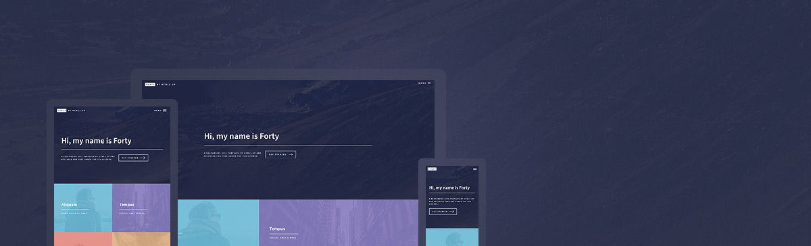

# Personal Brand Website

Website [patrickrosales.com](https://www.patrickrosales.com/)

Theme is based on a Jekyll version of the "Forty" theme by [HTML5 UP](https://html5up.net/).  

# Added Features

* **[Formspree.io](https://formspree.io/) contact form integration** - just add your email to the `_config.yml` and it works!
* Use `_config.yml` to **set whether the homepage tiles should pull pages or posts**, as well as how many to display.
* Add your **social profiles** easily in `_config.yml`. Only social profiles buttons you enter in `config.yml` show up on the site footer!
* Set **featured images** in front matter.
